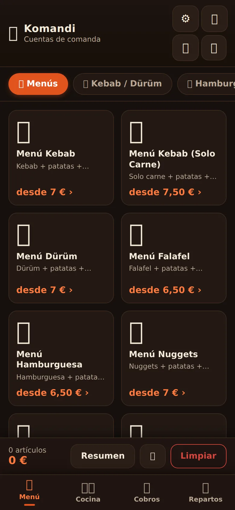
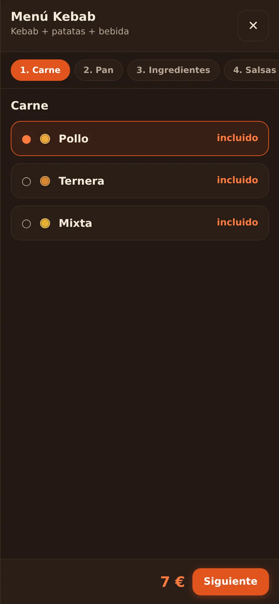
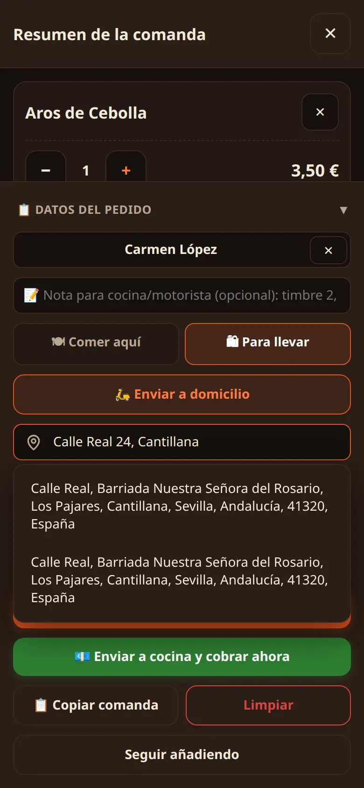
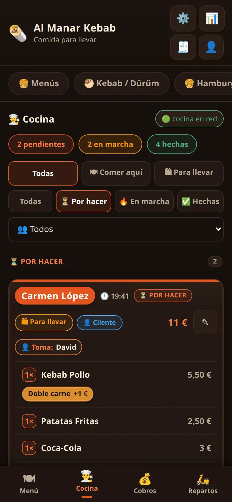
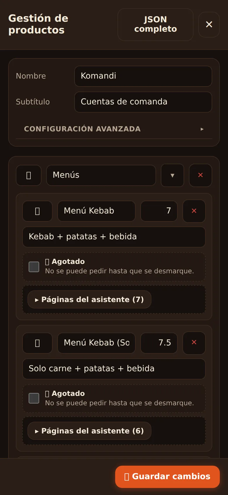
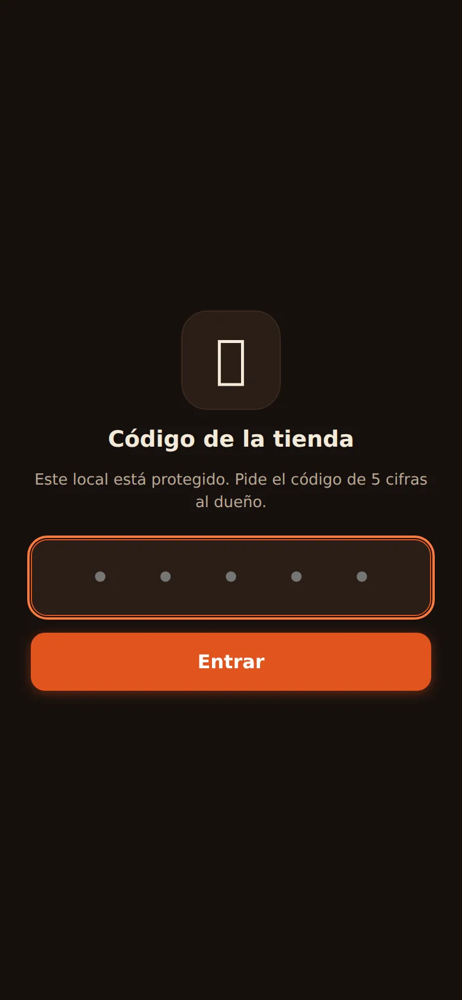

# 🥙 Komandi

**La comanda de tu negocio, en el móvil que ya tienes.**

Landing + PWA de **Komandi**, la app de comandas para comida para llevar: el
comandero toma el pedido en su móvil (pestaña **Carta**) y la **Cocina** ve el
ticket en vivo al instante en otro dispositivo. Hecha para kebab,
hamburgueserías, pizzerías, pollos, bocadillerías, tacos, food trucks… y
cualquier local que pida en el mostrador y pase a cocina.

Sin terminales. Sin comisiones por pedido. Sin permanencia. En marcha en 10 minutos.

🌐 **En producción:** <https://jedahee.github.io/Komandi/>

---

## 📸 Así se ve

Capturas de la app en uso real, con datos de negocio de verdad. *(Se actualizan
solas en este README si sustituyes las imágenes en `assets/capturas/` manteniendo
el mismo nombre.)*

| | | |
|:-:|:-:|:-:|
| **Carta por categorías**  | **Asistente de pedido**  | **Resumen con total**  |
| **Ticket en vivo en cocina**  | **Editar precios desde el móvil**  | **Acceso protegido por PIN**  |

---

## 🚀 Demo gratuita

La **demo gratuita** es la app de verdad con un menú de ejemplo, **sin PIN**, sin
registro y sin caducidad:

- En la web: botón **«Probar gratis»** → [`demo/index.html`](demo/index.html)
- En local: `node build-demo.js` la regenera a partir de `../base/` y de los
  datos de ejemplo (`../kebab-cantillana/kebab-ali/datos/productos.json`).

> La demo nunca pide PIN y no debe indexarse: `robots.txt` excluye `/demo/` y el
> build inyecta `noindex, nofollow`.

---

## 🧱 Estructura del repositorio

- `index.html` · `styles.css` · `app.js` — la landing (web estática, sin frameworks).
- `sw.js` · `manifest.webmanifest` — PWA (network-first, soporte offline).
- `assets/` — logo, iconos, capturas `webp`, vídeo de demostración y la imagen
  Open Graph `og-1200x630.jpg`.
- `demo/index.html` + `build-demo.js` — la demo de la app, en un solo archivo.
- `robots.txt` · `sitemap.xml` · `.nojekyll` — SEO e indexación (ver abajo).

El **código de la app** (no la landing) vive en el repo
[`Kebab-Base`](https://github.com/jedahee/Kebab-Base): el servicio Node.js, la
SPA de comandas/cocina, el despliegue multitienda y los scripts de tienda
(`crear-tienda.sh`, `actualizar-tienda.sh`, `sync-datos.sh`, `pin.sh`).

---

## 🔍 SEO e indexación

- **URL canónica** y todos los metadatos (OG / Twitter / JSON-LD) apuntan a
  `https://jedahee.github.io/Komandi/`. El `hreflang` es `es` + `x-default`.
- **JSON-LD** (`<script type="application/ld+json">`): `WebSite`, `Organization`
  (con `sameAs` a Instagram y `contactPoint` de email), `SoftwareApplication`
  (con `offers`, `screenshot` y `featureList`) y `Product` con los dos planes,
  todo coherente con los textos visibles de la página (14,99 €/mes y 149,99 €/año).
- **FAQPage** con las 13 preguntas que se ven en la sección FAQ (Google exige
  que las respuestas estén en la página).
- `robots.txt` permite `*`, bloquea `/demo/` y anuncia el sitemap.
- `sitemap.xml` lista la home. `manifest.webmanifest` sirve la instalación PWA.
- El **Service Worker no cachea `/demo/`** ni interfiere con su `noindex`.

---

## 📬 Contacto

- Email: **komandiapp@gmail.com**
- Instagram: **@komandiapp** (<https://www.instagram.com/komandiapp>)
- Horario de soporte: **10:00 a 20:00**

Los datos se configuran en una sola constante (`SITIO` en `app.js`) y se
propagan a todos los enlaces, el pie, el sector de contacto y los `mailto:`.

---

## 💶 Planes

| | 📅 Mensual | 🗓 Anual | 🛠 A medida |
|:-:|:-:|:-:|:-:|
| **Precio** | **14,99 €/mes** | **149,99 €/año** | Presupuesto aparte |
| **Alta** | 29,99 € (una vez) | ✅ Incluida | — |
| **Permanencia** | Sin permanencia | Sin permanencia | — |
| **Extra** | Primer mes gratis | 12 meses al precio de 10 | Calculadora de presupuesto en la web |

Todos los planes incluyen la **app completa** (carta, asistente, cocina en vivo,
resumen y estadísticas por día), protección por PIN, configuración en colaboración
contigo, gestión de dispositivos y soporte por email e Instagram de
**10:00 a 20:00**.

> Sin comisión por pedido. Sin contrato. Primer mes gratis.

---

## 🚚 Despliegue (GitHub Pages)

La web se publica en **GitHub Pages** desde la rama `main` (carpeta raíz) del
repositorio `jedahee/Komandi`:

1. Cualquier `git push` a `main` despliega la nueva versión en
   `https://jedahee.github.io/Komandi/` (GitHub Pages la activa
   automáticamente; no hace falta rama separada ni build).
2. Los cambios de **código de la app** se despliegan a las tiendas con
   `base/actualizar-tienda.sh` (nunca toca los `datos/` de las tiendas).
3. Tras desplegar, si cambia la carta/demo: `node build-demo.js` y commit.

---

## 📄 Licencia

MIT. Libre para copiar, usar y contribuir.